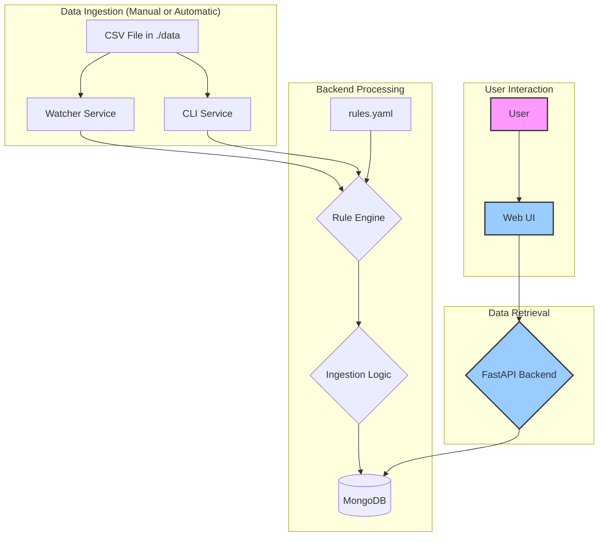

# Data Flows and Schemas

This document provides a detailed description of the data flow through the HTTP Traffic Tagger application, the schemas used at various stages, and a diagram illustrating the entire process.

---

## I. Data Flow Description

The application's data flow can be broken down into two primary processes: **Ingestion** and **Retrieval**.

### 1. Ingestion Flow

The ingestion process begins when new HTTP traffic data is introduced to the system. This can happen in two ways:

1.  **Automatic Ingestion (Hot-Reload):** A user places a new `.csv` file into the `./data/` directory. The `watcher` service, which constantly monitors this directory, detects the new file.
2.  **Manual Ingestion:** A user executes the `cli` service via the command line, explicitly pointing to a `.csv` file.

Once a CSV file is detected or specified, the following steps occur:

1.  **Parsing:** The ingestion service (`watcher` or `cli`) reads the CSV file row by row. For each row, it takes the Base64-encoded `raw` (request) and `response_raw` fields and decodes them into plain text.

2.  **Rule Evaluation:** The ingestion service initializes the `RuleEngine` using the definitions found in `data/rules.yaml`. It then passes the decoded request and response strings to the engine's `evaluate()` method.

3.  **Matching & Highlighting:** The `RuleEngine` evaluates all enabled rules against the provided data. If a rule's conditions are met, the engine records the rule's name as a `tag` and also captures the specific substring from the data that caused the match. These captured substrings are called `highlights`.

4.  **Storage:** The ingestion service collects the data from the original CSV row, the decoded request/response, the list of matched `tags`, and the dictionary of `highlights`. It then constructs a single JSON document and upserts it into the `records` collection in the `http_tagger` MongoDB database, using the `source_id` as a unique key.

### 2. Retrieval Flow

The retrieval process is driven by a user interacting with the web interface.

1.  **User Interaction:** The user opens the web UI, which is a single-page application. The frontend JavaScript (`app.js`) immediately makes a request to the backend API to fetch all existing tags.

2.  **API Request:** The frontend communicates with the `api` service (a FastAPI application) via a set of REST endpoints.
    *   To get all tags and their counts, it calls `GET /api/tags`.
    *   When a user filters by tags, it calls `GET /api/records?tags=...`.
    *   When a user clicks on a specific record, it calls `GET /api/record/{record_id}`.

3.  **Database Query:** The `api` service receives these requests and queries the MongoDB database. It fetches the requested data, whether it's an aggregated list of tags, a summary of multiple records, or the full detail of a single record.

4.  **API Response:** The `api` service formats the data from the database into a JSON response and sends it back to the frontend.

5.  **Frontend Rendering:** The frontend JavaScript parses the JSON response and dynamically updates the HTML to display the information to the user. If the response for a single record contains `highlights`, the JavaScript will wrap the matched substrings in the request/response text with a `<span>` tag to visually highlight them.

---

## II. Data Flow Diagram



---

## III. Schemas

### 1. CSV Input Schema

This is the expected structure of the input `.csv` files. The most critical fields for the application are `id`, `raw`, and `response_raw`.

| Column Name                 | Description                                               |
| --------------------------- | --------------------------------------------------------- |
| `id`                        | Unique identifier for the record from the source system.  |
| `host`                      | Host name.                                                |
| `method`                    | HTTP method (GET, POST, etc.).                            |
| `path`                      | Request path.                                             |
| `http_version`              | HTTP version.                                             |
| `scheme`                    | URL scheme (http/https).                                  |
| `authority`                 | Authority component.                                      |
| `request_content_length`    | Request content length.                                   |
| `request_timestamp_start`   | Request start timestamp.                                  |
| `request_timestamp_end`     | Request end timestamp.                                    |
| `response_status_code`      | HTTP response status code.                                |
| `response_reason`           | Response reason phrase.                                   |
| `response_content_length`   | Response content length.                                  |
| `response_timestamp_start`  | Response start timestamp.                                 |
| `response_timestamp_end`    | Response end timestamp.                                   |
| `response_created_at`       | Response creation timestamp.                              |
| `raw`                       | **Base64-encoded raw HTTP request.**                      |
| `response_raw`              | **Base64-encoded raw HTTP response.**                     |

### 2. MongoDB Record Schema

This is the structure of a document stored in the `records` collection in MongoDB. It combines data from the CSV with data generated during processing (tags, highlights, etc.).

**Example Document:**
```json
{
  "_id": "635f8f7bcf86cd799439011",
  "source_id": 101,
  "host": "example.com",
  "method": "POST",
  "path": "/api/v1/login",
  "http_version": "HTTP/1.1",
  "scheme": "https",
  "authority": "example.com",
  "request_content_length": 54,
  "request_timestamp_start": 1667206000,
  "request_timestamp_end": 1667206001,
  "response_status_code": 200,
  "response_reason": "OK",
  "response_content_length": 128,
  "response_timestamp_start": 1667206001,
  "response_timestamp_end": 1667206002,
  "response_created_at": 1667206002,
  "decoded_request": "POST /api/v1/login HTTP/1.1\r\nHost: example.com\r\nContent-Type: application/json\r\n\r\n{\"username\":\"test@user.com\",\"password\":\"12345\"}",
  "request_decoding_error": false,
  "decoded_response": "HTTP/1.1 200 OK\r\nContent-Type: application/json\r\n\r\n{\"token\":\"xyz...\",\"status\":\"success\"}",
  "response_decoding_error": false,
  "tags": [
    "API Call",
    "Potential PII Leak"
  ],
  "highlights": {
    "API Call": ["/api/"],
    "Potential PII Leak": ["test@user.com"]
  },
  "processed_at": "2023-10-26T10:00:00.000Z",
  "source_file": "traffic_data_part1.csv"
}
```

### 3. API Response Schemas

These are examples of the JSON responses sent from the FastAPI backend to the frontend.

**`GET /api/tags`**

Returns a list of all unique tags and the number of records associated with each.

```json
{
  "tags": [
    { "name": "API Call", "count": 890 },
    { "name": "GraphQL Mutation", "count": 15 },
    { "name": "Potential PII Leak", "count": 45 }
  ]
}
```

**`GET /api/records?tags=API%20Call`**

Returns a summarized list of records that match the provided tags.

```json
{
  "records": [
    {
      "id": "635f8f7bcf86cd799439011",
      "source_id": 101,
      "host": "example.com",
      "method": "POST",
      "path": "/api/v1/login",
      "response_status_code": 200,
      "tags": ["API Call", "Potential PII Leak"]
    }
  ]
}
```

**`GET /api/record/635f8f7bcf86cd799439011`**

Returns the full details for a single record, which is identical in structure to the MongoDB schema shown above.

```